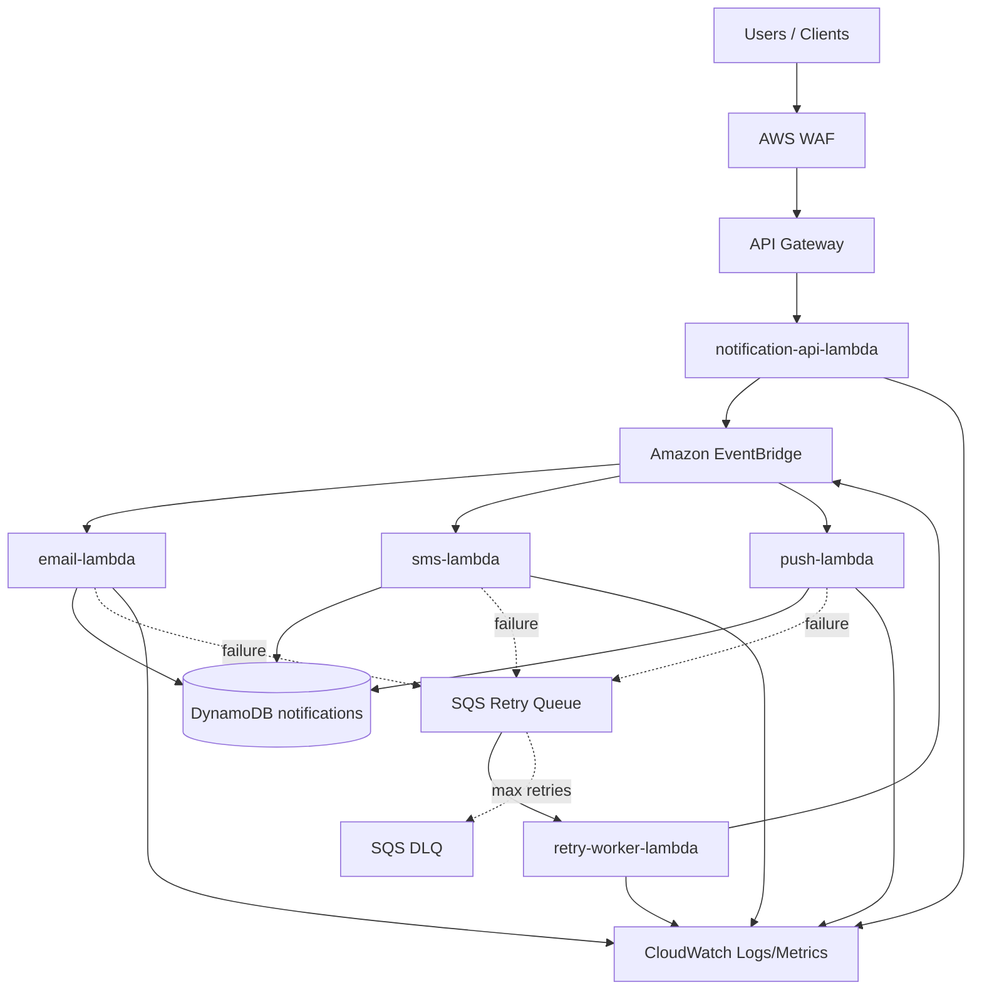

# Event-Driven Notification Platform

Serverless AWS event-driven notification platform with fan-out to independent channels (Email, SMS, and Push), SQS/DLQ retry flow, and CloudWatch observability.

## Architecture



## Applied Principles

- Event Driven Architecture: producers publish events without knowing consumers.
- Fan-out pattern: EventBridge routes events to multiple destinations.
- SOLID: responsibilities split across use cases, repository, and publisher.
- KISS and YAGNI: no artificial layers or unnecessary features.
- Least privilege: IAM permissions scoped to only required resources.

## Project Structure

- src/domain: entities, enums, and domain errors.
- src/application: use cases and interfaces (ports).
- src/infrastructure: AWS implementations (DynamoDB, EventBridge, SQS, logger).
- src/handlers: API Lambdas, consumers, and retry worker.
- src/tests: unit and integration tests.
- terraform: complete infrastructure (API Gateway, WAF, IAM, Lambda, EventBridge, SQS, DynamoDB).

## API

### Create Notification

POST /notifications

Body:

```json
{
  "eventType": "OrderApproved",
  "recipient": "user@email.com",
  "channels": ["EMAIL", "SMS"],
  "payload": {
    "orderId": "12345"
  }
}
```

Response 201:

```json
{
  "id": "uuid",
  "status": "PENDING"
}
```

### List Notifications

GET /notifications

### Get Notification by ID

GET /notifications/{id}

### Cancel Notification

DELETE /notifications/{id}

## Events

Event published to EventBridge by the API:

```json
{
  "id": "uuid",
  "type": "OrderApproved",
  "source": "notification-api",
  "time": "2026-01-01T10:00:00.000Z",
  "data": {
    "id": "uuid",
    "eventType": "OrderApproved",
    "recipient": "user@email.com",
    "channels": ["EMAIL", "SMS"],
    "payload": {
      "orderId": "12345"
    }
  }
}
```

## Local Execution

### Requirements

- Node.js 22+
- npm 10+
- Terraform 1.6+

### Steps

1. Install dependencies:

```bash
npm install
```

2. Run lint:

```bash
npm run lint
```

3. Run unit coverage gate (100%):

```bash
npm run test:unit
```

4. Run integration tests:

```bash
npm run test:integration
```

5. Build:

```bash
npm run build
```

## E2E with LocalStack

1. Run bootstrap + E2E in a single command:

```bash
npm run test:e2e:localstack
```

2. Optional commands (manual):

```bash
npm run localstack:up
npm run localstack:health
npm run test:e2e
npm run test:e2e:coverage
npm run localstack:down
```

The script automatically reuses an already running LocalStack on port 4566, avoiding bind conflicts.

After `bootstrap:local`, the script also generates [postman/localstack.postman_environment.json](postman/localstack.postman_environment.json) with the LocalStack-resolvable API URL and API key.

## Full Local Bootstrap (Docker + Terraform)

Anyone can bootstrap the local environment with a single command:

```bash
npm run bootstrap:local
```

If port 4566 is already in use, run with a dedicated port:

```bash
LOCALSTACK_ENDPOINT=http://localhost:4567 LOCALSTACK_HOST_PORT=4567 npm run bootstrap:local
```

This command will:

- start/reuse LocalStack
- build the project
- create dist/lambdas.zip
- run terraform init + terraform apply in LocalStack mode
- generate the Postman environment file for local testing

Use [postman/event-driven-notification-platform.postman_collection.json](postman/event-driven-notification-platform.postman_collection.json) together with [postman/localstack.postman_environment.json](postman/localstack.postman_environment.json) to test the API in Postman.

To destroy everything:

```bash
npm run destroy:local
```

## Deploy with Terraform

1. Build the project:

```bash
npm run build
```

2. Generate Lambda zip package (example):

```bash
cd dist && zip -r lambdas.zip .
```

3. Apply infrastructure:

```bash
cd terraform
terraform init
terraform plan -var="api_key_value=CHANGE_ME"
terraform apply -var="api_key_value=CHANGE_ME"
```

## Observability

Structured CloudWatch logs:

- notification-created
- event-published
- delivery-success
- delivery-failed
- retry-published
- retry-limit-reached

Recommended metrics:

- NotificationsCreated
- NotificationsDelivered
- NotificationsFailed
- RetryCount

## CI/CD

GitHub Actions pipeline in .github/workflows/ci-cd.yml with stages:

- validate job: lint, unit/integration tests, build, and terraform validate
- e2e-localstack job: starts dedicated LocalStack profile and runs real E2E
- deploy job (main): runs only after validate + e2e-localstack

## Test Coverage

Current test suite status:

- 13 suites (unit/integration)
- 53 tests
- global coverage: 100% statements, 100% branches, 100% functions, 100% lines
