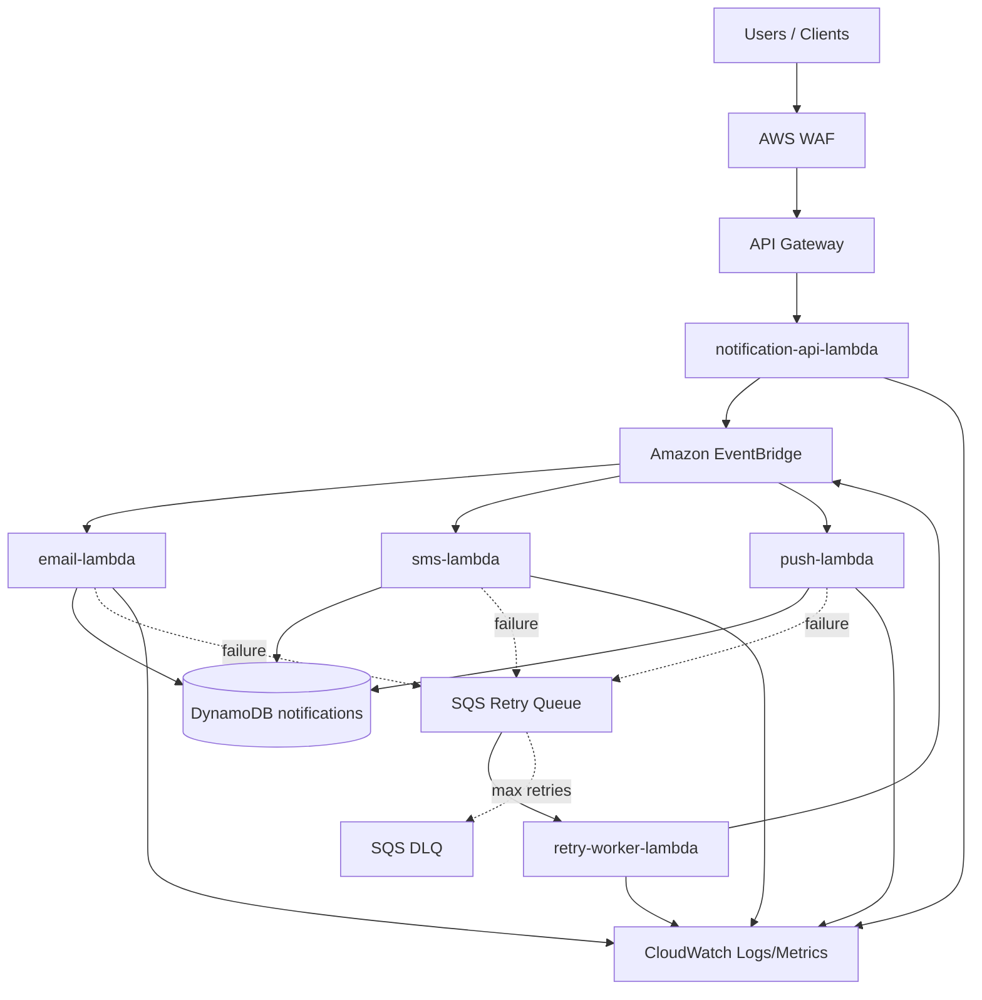

# Event-Driven Notification Platform

Serverless AWS event-driven notification platform with fan-out to independent channels (Email, SMS, and Push), SQS/DLQ retry flow, and CloudWatch observability.

## Architecture


```mermaid
flowchart TD
    U[Users / Clients] --> WAF[AWS WAF]
    WAF --> APIGW[API Gateway]
    APIGW --> API[notification-api-lambda]
    API --> EB[Amazon EventBridge]

    EB --> E[email-lambda]
    EB --> S[sms-lambda]
    EB --> P[push-lambda]

    E --> DDB[(DynamoDB notifications)]
    S --> DDB
    P --> DDB

    E -. failure .-> RQ[SQS Retry Queue]
    S -. failure .-> RQ
    P -. failure .-> RQ

    RQ --> RW[retry-worker-lambda]
    RW --> EB

    RQ -. max retries .-> DLQ[SQS DLQ]

    API --> CW[CloudWatch Logs/Metrics]
    E --> CW
    S --> CW
    P --> CW
    RW --> CW
```

## Applied Principles

- Event Driven Architecture: producers publish events without knowing consumers.
- Fan-out pattern: EventBridge routes events to multiple destinations.
- SOLID: responsibilities split across use cases, repository, and publisher.
- KISS and YAGNI: no artificial layers or unnecessary features.
- Least privilege: each Lambda (`notification-api`, `email`, `sms`, `push`, `retry-worker`) has its own dedicated IAM role in [terraform/iam.tf](terraform/iam.tf), scoped only to the actions that function actually calls (e.g. `retry-worker` gets `dynamodb:UpdateItem` but never `PutItem`/`Scan`, and never touches the DLQ directly).

## Project Structure

- src/domain: entities, enums, and domain errors.
- src/application: use cases and interfaces (ports).
- src/infrastructure: AWS implementations (DynamoDB, EventBridge, SQS, logger).
- src/handlers: API Lambdas, consumers, and retry worker.
- src/tests: unit and integration tests.
- terraform: complete infrastructure (API Gateway, WAF, IAM, Lambda, EventBridge, SQS, DynamoDB).

## API

### Create Notification

POST /notifications

Body:

```json
{
  "eventType": "OrderApproved",
  "recipient": "user@email.com",
  "channels": ["EMAIL", "SMS"],
  "payload": {
    "orderId": "12345"
  }
}
```

> Note: `channels` filters which of the already-triggered consumer Lambdas will process the notification. It does not force EventBridge to invoke a Lambda outside its configured rule — see [EventBridge Rules](#eventbridge-rules).

Response 201:

```json
{
  "id": "uuid",
  "status": "PENDING"
}
```

### List Notifications

GET /notifications

### Get Notification by ID

GET /notifications/{id}

Response 200:

```json
{
  "id": "uuid",
  "eventType": "OrderApproved",
  "recipient": "user@email.com",
  "channels": ["EMAIL", "SMS"],
  "payload": { "orderId": "12345" },
  "status": "PENDING",
  "retryCount": 0,
  "canceledAt": null,
  "channelStates": {
    "EMAIL": { "status": "DELIVERED", "retryCount": 0 },
    "SMS": { "status": "PENDING", "retryCount": 0 }
  },
  "createdAt": "2026-01-01T10:00:00.000Z",
  "updatedAt": "2026-01-01T10:00:01.000Z"
}
```

`channelStates` tracks each requested channel independently, so a partial fan-out is visible instead of being flattened into one shared status: in the example above `EMAIL` was delivered while `SMS` is still `PENDING` (never routed, since `OrderApproved` isn't in the `sms_rule` — see [EventBridge Rules](#eventbridge-rules)). The top-level `status` is an aggregate derived from `channelStates`, in this priority: `RETRYING` > `PROCESSING` > `FAILED` > `DELIVERED` (only once every channel is `DELIVERED`) > `PENDING`. `retryCount` is the highest retry count across all channels.

### Cancel Notification

DELETE /notifications/{id}

Rejects the cancellation with `400` if the notification was already `DELIVERED` or is already `CANCELED`; otherwise returns `200` with the canceled notification.

## EventBridge Rules

Routing to each consumer Lambda is decided by **EventBridge rules matching `detail-type` (the notification's `eventType`)**, not by the `channels` field sent in the request. The `channels` field is only a secondary filter applied **inside** a consumer Lambda that has already been invoked (see [process-consumer-event.ts](src/handlers/consumers/process-consumer-event.ts)): if the Lambda's channel is not present in `channels`, it simply skips processing.

| Event type            | email-lambda | sms-lambda | push-lambda |
| ---------------------- | :-----------: | :--------: | :----------: |
| OrderApproved           | ✅            |            | ✅           |
| UserRegistered          | ✅            |            |              |
| PasswordChanged         | ✅            | ✅         |              |
| PaymentFailed           |               | ✅         |              |
| DocumentProcessed       |               |            | ✅           |
| NotificationRequested (retry) | ✅      | ✅         | ✅           |

Practical implication: requesting `"eventType": "OrderApproved"` with `"channels": ["EMAIL", "SMS"]` will **not** deliver via SMS, because the `sms_rule` in [terraform/eventbridge.tf](terraform/eventbridge.tf) does not subscribe to `OrderApproved`. Only `EMAIL` and `PUSH` are eligible for that event type. To test SMS delivery, use an event type the SMS rule listens to, e.g. `PaymentFailed` or `PasswordChanged`.

## Events

Event published to EventBridge by the API:

```json
{
  "id": "uuid",
  "type": "OrderApproved",
  "source": "notification-api",
  "time": "2026-01-01T10:00:00.000Z",
  "data": {
    "id": "uuid",
    "eventType": "OrderApproved",
    "recipient": "user@email.com",
    "channels": ["EMAIL", "SMS"],
    "payload": { "orderId": "12345" },
    "channelStates": {
      "EMAIL": { "status": "PENDING", "retryCount": 0 },
      "SMS": { "status": "PENDING", "retryCount": 0 }
    },
    "canceledAt": null,
    "status": "PENDING",
    "retryCount": 0
  }
}
```

## Retry & Failure Lifecycle

On a channel send failure, [process-channel-notification.ts](src/application/usecases/process-channel-notification.ts) marks that channel `RETRYING` and enqueues it to the SQS retry queue. [retry-worker-lambda.ts](src/handlers/retry/retry-worker-lambda.ts) consumes the queue and republishes a `NotificationRequested` event (re-triggering only the failed channel) as long as `retryCount <= MAX_RETRIES`. Once the budget is exhausted, [retry-notification.ts](src/application/usecases/retry-notification.ts) marks that channel `FAILED` instead of republishing, so the notification always reaches a terminal state instead of sitting in `RETRYING` indefinitely.

Two independent failure paths exist:

- **Business retry limit** (`MAX_RETRIES`, default 3): governs how many times a channel is *retried*. Exhausting it marks the channel `FAILED` — no message loss, no SQS involvement.
- **SQS redrive policy** (`max_retries` on `aws_sqs_queue.retry_queue` in [terraform/sqs.tf](terraform/sqs.tf)): governs how many times SQS redelivers a *single message* to `retry-worker-lambda` if the Lambda invocation itself fails (e.g. a transient AWS/network error). After that many failed deliveries the message goes to the DLQ (`retry-dlq`), which is a genuine, exercised safety net for infrastructure-level failures — not a dead end for exhausted business retries.

The SQS event source mapping uses `ReportBatchItemFailures` ([terraform/lambda.tf](terraform/lambda.tf)), so if one message in a batch fails, only that message is redelivered — the rest of the batch isn't reprocessed.

## Local Execution

### Requirements

- Node.js 22+
- npm 10+
- Terraform 1.6+

### Steps

1. Install dependencies:

```bash
npm install
```

2. Run lint:

```bash
npm run lint
```

3. Run unit coverage gate (100%):

```bash
npm run test:unit
```

4. Run integration tests:

```bash
npm run test:integration
```

5. Build:

```bash
npm run build
```

## E2E with LocalStack

1. Run bootstrap + E2E in a single command:

```bash
npm run test:e2e:localstack
```

2. Optional commands (manual):

```bash
npm run localstack:up
npm run localstack:health
npm run test:e2e
npm run test:e2e:coverage
npm run localstack:down
```

The script automatically reuses an already running LocalStack on port 4566, avoiding bind conflicts.

After `bootstrap:local`, the script also generates [postman/localstack.postman_environment.json](postman/localstack.postman_environment.json) with the LocalStack-resolvable API URL and API key.

## Full Local Bootstrap (Docker + Terraform)

Anyone can bootstrap the local environment with a single command:

```bash
npm run bootstrap:local
```

If port 4566 is already in use, run with a dedicated port:

```bash
LOCALSTACK_ENDPOINT=http://localhost:4567 LOCALSTACK_HOST_PORT=4567 npm run bootstrap:local
```

This command will:

- start/reuse LocalStack
- build the project
- create dist/lambdas.zip
- run terraform init + terraform apply in LocalStack mode
- generate the Postman environment file for local testing

Use [postman/event-driven-notification-platform.postman_collection.json](postman/event-driven-notification-platform.postman_collection.json) together with [postman/localstack.postman_environment.json](postman/localstack.postman_environment.json) to test the API in Postman.

To destroy everything:

```bash
npm run destroy:local
```

## Deploy with Terraform

1. Build the project:

```bash
npm run build
```

2. Generate Lambda zip package (example):

```bash
cd dist && zip -r lambdas.zip .
```

3. Apply infrastructure:

```bash
cd terraform
terraform init
terraform plan -var="api_key_value=CHANGE_ME"
terraform apply -var="api_key_value=CHANGE_ME"
```

## Observability

Structured CloudWatch logs:

- notification-created
- event-published
- delivery-success
- delivery-failed
- retry-published
- retry-limit-reached

Recommended metrics:

- NotificationsCreated
- NotificationsDelivered
- NotificationsFailed
- RetryCount

### Inspecting logs locally (LocalStack)

The `docker-compose.localstack.yml` `SERVICES` list does not include the `logs` (CloudWatch Logs) service, so `aws logs ...` against LocalStack returns `Service 'logs' is not enabled`. To inspect a Lambda's structured logs locally, read them directly from its execution container instead:

```bash
docker ps --format '{{.Names}}' | grep 'localstack-lambda'
docker logs <container-name> | grep '"level"'
```

Each Lambda (`notification-api`, `email`, `sms`, `push`, `retry-worker`) runs in its own container named `event-driven-localstack-lambda-<function-name>-<hash>`.

## CI/CD

GitHub Actions pipeline in .github/workflows/ci-cd.yml with stages:

- validate job: lint, unit/integration tests, build, and terraform validate
- e2e-localstack job: starts dedicated LocalStack profile and runs real E2E
- deploy job (main): runs only after validate + e2e-localstack passes; today this is a CI-only gate (`terraform validate` again) and does **not** run `terraform apply` against real AWS — there's no AWS credentials step in the workflow. Promoting to a real environment is a separate, deliberately manual/CD step outside this pipeline.

## Test Coverage

Current test suite status:

- 13 suites (unit/integration)
- 61 tests
- global coverage: 100% statements, 100% branches, 100% functions, 100% lines
- consolidated modules to avoid unnecessary file fragmentation: `application/ports` (index), `domain/enums` (index), `domain/errors` (index), `application/usecases/query-notifications.ts` (get + list), and `handlers/consumers/channel-lambdas.ts` (email/sms/push handlers)
