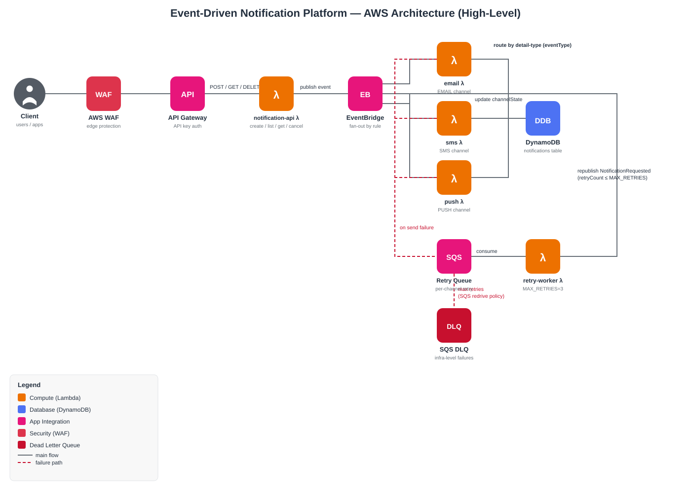
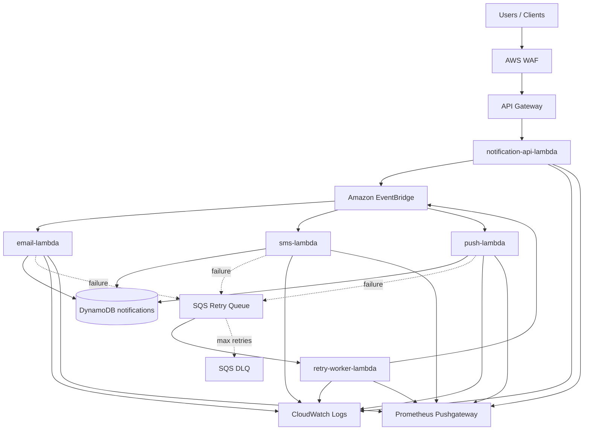

# Event-Driven Notification Platform

Serverless AWS event-driven notification platform with fan-out to independent channels (Email, SMS, and Push), SQS/DLQ retry flow, and observability via CloudWatch logs plus a local Prometheus/Grafana/Loki stack.

## Architecture




```mermaid
flowchart TD
    U[Users / Clients] --> WAF[AWS WAF]
    WAF --> APIGW[API Gateway]
    APIGW --> API[notification-api-lambda]
    API --> EB[Amazon EventBridge]

    EB --> E[email-lambda]
    EB --> S[sms-lambda]
    EB --> P[push-lambda]

    E --> DDB[(DynamoDB notifications)]
    S --> DDB
    P --> DDB

    E -. failure .-> RQ[SQS Retry Queue]
    S -. failure .-> RQ
    P -. failure .-> RQ

    RQ --> RW[retry-worker-lambda]
    RW --> EB

    RQ -. max retries .-> DLQ[SQS DLQ]

    API --> CW[CloudWatch Logs]
    E --> CW
    S --> CW
    P --> CW
    RW --> CW

    API --> PG[Prometheus Pushgateway]
    E --> PG
    S --> PG
    P --> PG
    RW --> PG
```

Diagram sources live in [docs/mmd](docs/mmd) (Mermaid) with rendered PNGs in [docs/img](docs/img):

- [architecture](docs/img/architecture.png) — the system diagram above.
- [retry-lifecycle](docs/img/retry-lifecycle.png) — the two independent failure paths from [Retry & Failure Lifecycle](#retry--failure-lifecycle).
- [deployment](docs/img/deployment.png) — local Docker/LocalStack dev setup vs. the Terraform-managed AWS resources.

## Applied Principles

- Event Driven Architecture: producers publish events without knowing consumers.
- Fan-out pattern: EventBridge routes events to multiple destinations.
- SOLID: responsibilities split across use cases, repository, and publisher.
- KISS and YAGNI: no artificial layers or unnecessary features.
- Least privilege: each Lambda (`notification-api`, `email`, `sms`, `push`, `retry-worker`) has its own dedicated IAM role in [terraform/iam.tf](terraform/iam.tf), scoped only to the actions that function actually calls (e.g. `retry-worker` gets `dynamodb:UpdateItem` but never `PutItem`/`Scan`, and never touches the DLQ directly).

## Project Structure

- src/domain: entities, enums, and domain errors.
- src/application: use cases and interfaces (ports).
- src/infrastructure: AWS implementations (DynamoDB, EventBridge, SQS, logger, Prometheus metrics).
- src/handlers: API Lambdas, consumers, and retry worker.
- src/tests: unit and integration tests.
- terraform: complete infrastructure (API Gateway, WAF, IAM, Lambda, EventBridge, SQS, DynamoDB, CloudWatch Alarms, SNS).

## API

### Create Notification

POST /notifications

Body:

```json
{
  "eventType": "OrderApproved",
  "recipient": "user@email.com",
  "channels": ["EMAIL", "SMS"],
  "payload": {
    "orderId": "12345"
  }
}
```

> Note: `channels` filters which of the already-triggered consumer Lambdas will process the notification. It does not force EventBridge to invoke a Lambda outside its configured rule — see [EventBridge Rules](#eventbridge-rules).

> Demo hook: since there is no real Email/SMS/Push provider, sending `payload.forceFail: true` makes [channel-senders.ts](src/infrastructure/aws/channel-senders.ts) throw on delivery, letting you exercise the retry/DLQ path (see [Retry & Failure Lifecycle](#retry--failure-lifecycle)) on demand instead of waiting for a real failure.

> `payload` is capped at 350,000 bytes (checked in [notification.ts](src/domain/entities/notification.ts)) to stay under DynamoDB's 400KB item size limit with headroom for the rest of the item's attributes; an oversized payload is rejected with `400` at creation instead of failing later on `PutItem`.

Response 201:

```json
{
  "id": "uuid",
  "status": "PENDING"
}
```

### List Notifications

GET /notifications?limit=20&nextToken=...

Both query params are optional. `limit` defaults to 20 and is clamped between 1 and 100 server-side; the underlying DynamoDB `Scan` in [dynamo-notification-repository.ts](src/infrastructure/dynamodb/dynamo-notification-repository.ts) always applies this bound, so a single request can never scan or return an unbounded number of items. `nextToken` is an opaque, base64-encoded cursor — pass the `nextToken` from the previous response to fetch the next page; it is omitted once there are no more pages.

Response 200:

```json
{
  "items": [{ "id": "uuid", "status": "PENDING" }],
  "nextToken": "eyJpZCI6ICJ1dWlkIn0="
}
```

### Get Notification by ID

GET /notifications/{id}

Response 200:

```json
{
  "id": "uuid",
  "eventType": "OrderApproved",
  "recipient": "user@email.com",
  "channels": ["EMAIL", "SMS"],
  "payload": { "orderId": "12345" },
  "status": "PENDING",
  "retryCount": 0,
  "canceledAt": null,
  "channelStates": {
    "EMAIL": { "status": "DELIVERED", "retryCount": 0 },
    "SMS": { "status": "PENDING", "retryCount": 0 }
  },
  "createdAt": "YYYY-MM-DDThh:mm:ss.sssZ",
  "updatedAt": "YYYY-MM-DDThh:mm:ss.sssZ"
}
```

`channelStates` tracks each requested channel independently, so a partial fan-out is visible instead of being flattened into one shared status: in the example above `EMAIL` was delivered while `SMS` is still `PENDING` (never routed, since `OrderApproved` isn't in the `sms_rule` — see [EventBridge Rules](#eventbridge-rules)). The top-level `status` is an aggregate derived from `channelStates`, in this priority: `RETRYING` > `PROCESSING` > `FAILED` > `DELIVERED` (only once every channel is `DELIVERED`) > `PENDING`. `retryCount` is the highest retry count across all channels.

### Cancel Notification

DELETE /notifications/{id}

Rejects the cancellation with `400` if the notification was already `DELIVERED` or is already `CANCELED`; otherwise returns `200` with the canceled notification.

## EventBridge Rules

Routing to each consumer Lambda is decided by **EventBridge rules matching `detail-type` (the notification's `eventType`)**, not by the `channels` field sent in the request. The `channels` field is only a secondary filter applied **inside** a consumer Lambda that has already been invoked (see [process-consumer-event.ts](src/handlers/consumers/process-consumer-event.ts)): if the Lambda's channel is not present in `channels`, it simply skips processing.

| Event type                    | email-lambda | sms-lambda | push-lambda |
| ----------------------------- | :----------: | :--------: | :---------: |
| OrderApproved                 |      ✅      |            |     ✅      |
| UserRegistered                |      ✅      |            |             |
| PasswordChanged               |      ✅      |     ✅     |             |
| PaymentFailed                 |              |     ✅     |             |
| DocumentProcessed             |              |            |     ✅      |
| NotificationRequested (retry) |      ✅      |     ✅     |     ✅      |

Practical implication: requesting `"eventType": "OrderApproved"` with `"channels": ["EMAIL", "SMS"]` will **not** deliver via SMS, because the `sms_rule` in [terraform/eventbridge.tf](terraform/eventbridge.tf) does not subscribe to `OrderApproved`. Only `EMAIL` and `PUSH` are eligible for that event type. To test SMS delivery, use an event type the SMS rule listens to, e.g. `PaymentFailed` or `PasswordChanged`.

## Events

Event published to EventBridge by the API:

```json
{
  "id": "uuid",
  "type": "OrderApproved",
  "source": "notification-api",
  "time": "YYYY-MM-DDThh:mm:ss.sssZ",
  "data": {
    "id": "uuid",
    "eventType": "OrderApproved",
    "recipient": "user@email.com",
    "channels": ["EMAIL", "SMS"],
    "payload": { "orderId": "12345" },
    "channelStates": {
      "EMAIL": { "status": "PENDING", "retryCount": 0 },
      "SMS": { "status": "PENDING", "retryCount": 0 }
    },
    "canceledAt": null,
    "status": "PENDING",
    "retryCount": 0
  }
}
```

## Retry & Failure Lifecycle

On a channel send failure, [process-channel-notification.ts](src/application/usecases/process-channel-notification.ts) marks that channel `RETRYING` and enqueues it to the SQS retry queue. [retry-worker-lambda.ts](src/handlers/retry/retry-worker-lambda.ts) consumes the queue and republishes a `NotificationRequested` event (re-triggering only the failed channel) as long as `retryCount <= MAX_RETRIES`. Once the budget is exhausted, [retry-notification.ts](src/application/usecases/retry-notification.ts) marks that channel `FAILED` instead of republishing, so the notification always reaches a terminal state instead of sitting in `RETRYING` indefinitely.

Two independent failure paths exist:

- **Business retry limit** (`MAX_RETRIES`, default 3): governs how many times a channel is _retried_. Exhausting it marks the channel `FAILED` — no message loss, no SQS involvement.
- **SQS redrive policy** (`max_retries` on `aws_sqs_queue.retry_queue` in [terraform/sqs.tf](terraform/sqs.tf)): governs how many times SQS redelivers a _single message_ to `retry-worker-lambda` if the Lambda invocation itself fails (e.g. a transient AWS/network error). After that many failed deliveries the message goes to the DLQ (`retry-dlq`), which is a genuine, exercised safety net for infrastructure-level failures — not a dead end for exhausted business retries.

The SQS event source mapping uses `ReportBatchItemFailures` ([terraform/lambda.tf](terraform/lambda.tf)), so if one message in a batch fails, only that message is redelivered — the rest of the batch isn't reprocessed.

## Local Execution

### Requirements

- Node.js 22+ (enforced via `engines` in [package.json](package.json))
- npm 10+
- Terraform 1.6+
- Docker (for LocalStack-based E2E/API testing)

### Steps

1. Install dependencies:

```bash
npm install
```

2. Check formatting:

```bash
npm run format:check
```

3. Run lint:

```bash
npm run lint
```

4. Run typecheck:

```bash
npm run typecheck
```

5. Run unit coverage gate (100%):

```bash
npm run test:unit
```

6. Run integration tests:

```bash
npm run test:integration
```

7. Build:

```bash
npm run build
```

## E2E with LocalStack

1. Run bootstrap + E2E in a single command:

```bash
npm run test:e2e:localstack
```

2. Optional commands (manual):

```bash
npm run localstack:up
npm run localstack:health
npm run test:e2e
npm run test:e2e:coverage
npm run localstack:down
```

The script automatically reuses an already running LocalStack on port 4566, avoiding bind conflicts.

After `bootstrap:local`, the script also generates [postman/localstack.postman_environment.json](postman/localstack.postman_environment.json) with the LocalStack-resolvable API URL and API key.

## Full Local Bootstrap (Docker + Terraform)

Anyone can bootstrap the local environment with a single command:

```bash
npm run bootstrap:local
```

If port 4566 is already in use, run with a dedicated port:

```bash
LOCALSTACK_ENDPOINT=http://localhost:4567 LOCALSTACK_HOST_PORT=4567 npm run bootstrap:local
```

This command will:

- start/reuse LocalStack
- build the project
- create dist/lambdas.zip
- run terraform init + terraform apply in LocalStack mode
- generate the Postman environment file for local testing

Use [postman/event-driven-notification-platform.postman_collection.json](postman/event-driven-notification-platform.postman_collection.json) together with [postman/localstack.postman_environment.json](postman/localstack.postman_environment.json) to test the API in Postman.

To destroy everything:

```bash
npm run destroy:local
```

## API / Collection Tests

With the stack deployed locally (`npm run bootstrap:local`), run the Postman collection headlessly via [newman](https://www.npmjs.com/package/newman):

```bash
npm run test:api -- -e postman/localstack.postman_environment.json
```

`newman` is intentionally not a project dependency — its own dependency tree carries unresolved advisories (including a critical one in a transitive `handlebars` version), so it is invoked on demand via `npx` instead of being installed into `node_modules`/the lockfile.

The collection ([postman/event-driven-notification-platform.postman_collection.json](postman/event-driven-notification-platform.postman_collection.json)) covers, in order: create, list, get by id, cancel, cancel-again (`400` conflict on an already-terminal notification), a missing required field (`400`), an invalid channel (`400`), a malformed JSON body (`400`), a missing API key (`403`), an unknown id (`404`), and an unhandled method (`404`).

## Deploy with Terraform

1. Build the project:

```bash
npm run build
```

2. Generate Lambda zip package (example):

```bash
cd dist && zip -r lambdas.zip .
```

3. Apply infrastructure:

```bash
cd terraform
terraform init
terraform plan -var="api_key_value=CHANGE_ME"
terraform apply -var="api_key_value=CHANGE_ME"
```

Add `-var="alert_email=you@example.com"` to also subscribe an email address to the CloudWatch alarms SNS topic (see [Alerting](#alerting-cloudwatch-alarms--sns)); it is left empty by default.

### State

There is no `backend` block in [terraform/main.tf](terraform/main.tf): state is local (`terraform.tfstate`, gitignored). This project has no team-shared remote deploy flow, so an S3 bucket and lock table would be infrastructure with no user.

### Local validation

The same checks CI runs (see [CI/CD](#cicd)) can be run locally from `terraform/`:

```bash
terraform fmt -check -recursive
terraform validate
tflint --init && tflint --recursive
checkov -d . --config-file .checkov.yaml
```

`tflint` and `checkov` need to be installed separately (e.g. `brew install tflint` and `pip install checkov`) — they aren't npm dependencies.

## Observability

### CloudWatch Logs

Every Lambda writes structured JSON logs via [console-logger.ts](src/infrastructure/aws/console-logger.ts):

- notification-created
- event-published
- delivery-success
- delivery-failed
- retry-published
- retry-limit-reached

### Metrics (Prometheus)

Every Lambda (`notification-api`, the channel consumers, `retry-worker`) records metrics through the `Metrics` port, implemented by [prometheus-metrics.ts](src/infrastructure/aws/prometheus-metrics.ts), and pushes them to a Prometheus Pushgateway (`PUSHGATEWAY_URL` env var, wired from the `pushgateway_url` Terraform variable in [terraform/lambda.tf](terraform/lambda.tf)):

- `notifications_created_total{event_type}`
- `notification_delivery_attempts_total{channel,status}`
- `notification_delivery_duration_seconds{channel,status}` (histogram)
- `notification_retries_published_total{channel}`
- `notification_retries_exhausted_total{channel}`
- `notifications_canceled_total`

If `PUSHGATEWAY_URL` is unset, `flush()` is a no-op, so metrics collection never breaks the business flow.

### Local observability stack (Docker)

`npm run bootstrap:local` (and `npm run test:e2e:localstack`) brings up the `observability` Docker Compose profile in [docker-compose.localstack.yml](docker-compose.localstack.yml) alongside LocalStack: Prometheus, a Pushgateway, Grafana, Loki, and Promtail (which ships each Lambda container's structured logs into Loki). It can also be started/stopped on its own:

```bash
npm run observability:up
npm run observability:down
```

Once running:

- Grafana — http://localhost:3000 (`admin`/`admin`), with the pre-provisioned **Notification Platform** dashboard ([observability/grafana/dashboards/notification-platform.json](observability/grafana/dashboards/notification-platform.json)): notification/delivery rates, delivery success rate, delivery duration p95, retries published vs. exhausted, notifications canceled, and a live log panel (via Loki).
- Prometheus — http://localhost:9090
- Pushgateway — http://localhost:9091
- Loki — http://localhost:3100 (queried through Grafana, not directly)

Ports are overridable via `PROMETHEUS_HOST_PORT`, `PUSHGATEWAY_HOST_PORT`, `GRAFANA_HOST_PORT`, and `LOKI_HOST_PORT`.

### Inspecting logs locally without Grafana

The `docker-compose.localstack.yml` `SERVICES` list does not include the `logs` (CloudWatch Logs) service, so `aws logs ...` against LocalStack returns `Service 'logs' is not enabled`. As an alternative to the Grafana log panel above, read a Lambda's structured logs directly from its execution container:

```bash
docker ps --format '{{.Names}}' | grep 'localstack-lambda'
docker logs <container-name> | grep '"level"'
```

Each Lambda (`notification-api`, `email`, `sms`, `push`, `retry-worker`) runs in its own container named `event-driven-localstack-lambda-<function-name>-<hash>`.

### Alerting (CloudWatch Alarms + SNS)

Unlike the Prometheus/Grafana stack, which only runs locally, alerting is provisioned as real AWS infrastructure in [terraform/cloudwatch.tf](terraform/cloudwatch.tf) and [terraform/sns.tf](terraform/sns.tf), so it also applies to a real AWS deployment:

- Three `aws_cloudwatch_metric_alarm` per Lambda (`notification-api`, `email`, `sms`, `push`, `retry-worker`) on `AWS/Lambda`: `Errors > 0`, `Throttles > 0` (the function hit its `reserved_concurrent_executions` limit — see below), and p99 `Duration` above `lambda_duration_alarm_threshold_ratio` (default 80%) of its timeout.
- One alarm on the retry DLQ's `AWS/SQS` `ApproximateNumberOfMessagesVisible > 0` — since the DLQ is only reached by the SQS redrive policy (see [Retry & Failure Lifecycle](#retry--failure-lifecycle)), any message there means a genuine infrastructure-level failure, not an exhausted business retry.
- One alarm on API Gateway `AWS/ApiGateway` `5XXError > 0`. There is deliberately no 4XX alarm: this API returns `400`/`403`/`404` as expected, routine responses (see [API / Collection Tests](#api--collection-tests)), so a count-based alarm on it would fire on normal traffic.
- All alarms notify the `aws_sns_topic.alerts` SNS topic; set the `alert_email` Terraform variable to subscribe an email address to it (empty by default, so no subscription is created).

### Concurrency

Every Lambda sets `reserved_concurrent_executions` (the `lambda_reserved_concurrency` Terraform variable, default 10) so a traffic spike or a stuck downstream dependency on one function can't consume the account's entire concurrency pool and starve the others. The default is sized against the API's own `usage_plan` throttle (`api_throttle_burst_limit`, default 10 — see [terraform/variables.tf](terraform/variables.tf)).

## CI/CD

GitHub Actions pipeline in [.github/workflows/ci-cd.yml](.github/workflows/ci-cd.yml) with stages:

- **validate job**: install, `npm audit` (dependency/security check), format check, lint, typecheck, unit tests, integration tests, build, `terraform fmt -check`, `terraform validate`, [tflint](https://github.com/terraform-linters/tflint), and [checkov](https://www.checkov.io/) (config in [terraform/.checkov.yaml](terraform/.checkov.yaml), which documents why each skipped check doesn't apply to this project — everything else fails the build).
- **e2e-localstack job**: starts a dedicated LocalStack profile, runs the Jest E2E suite (with a 100% coverage gate), then builds the Lambda zip, deploys the real Terraform stack into that LocalStack instance, and runs the Postman collection against the live API Gateway endpoint via `newman` — the same commands documented in [API / Collection Tests](#api--collection-tests) and [Full Local Bootstrap](#full-local-bootstrap-docker--terraform). The Terraform resources and LocalStack container are torn down afterwards (`if: always()`).
- **deploy job** (main): runs only after validate + e2e-localstack pass; it is a CI-only gate (`terraform validate` again) and does **not** run `terraform apply` against real AWS — there's no AWS credentials step in the workflow. Applying to a real AWS account is a deliberately separate, manual step outside this pipeline (see [Deploy with Terraform](#deploy-with-terraform)).

There is no application `Dockerfile`: Lambdas are deployed as a zip archive ([terraform/lambda.tf](terraform/lambda.tf)), not container images, so "Docker" in this project means the LocalStack + observability stack in [docker-compose.localstack.yml](docker-compose.localstack.yml) used for local development and for the `e2e-localstack` CI job — there is no separate image to build.

## Test Coverage

Current test suite status:

- 15 suites: 13 unit, 1 integration, 1 E2E (LocalStack)
- 91 tests: 75 unit + 4 integration + 12 E2E
- unit coverage gate: 100% statements, 100% branches, 100% functions, 100% lines (`npm run test:unit`)
- E2E coverage gate: 100% on the API Lambda entry point (`npm run test:e2e:coverage`)
- modules stay consolidated rather than fragmented into one file per type: `application/ports` (index), `domain/enums` (index), `domain/errors` (index), `application/usecases/query-notifications.ts` (get + list), and `handlers/consumers/channel-lambdas.ts` (email/sms/push handlers)

## Dependencies

- Runtime dependencies are the AWS SDK v3 clients (DynamoDB, EventBridge, SQS) and `prom-client`; `npm audit` reports 0 known vulnerabilities.
- Dependencies are pinned to their current major version (see [package.json](package.json)); patch/minor updates are applied within that major version, e.g. TypeScript stays on 6.x since 7.x is a major bump the codebase doesn't require.
- `newman` (used only for [API / Collection Tests](#api--collection-tests)) is deliberately kept out of `package.json` — see that section for why.
